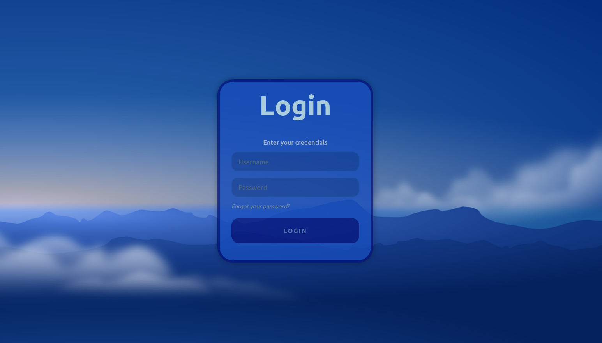

# Floating Login Form
Lets create a basic floating login form with cloudly and in motion background

# Branches dev1 and dev2
These Branches contain the same changes and look as follow:

# Branches joint, QA and Main
These last two Branches have the final touches on the UI and UX of our floating Login form

This is how it looks like:

